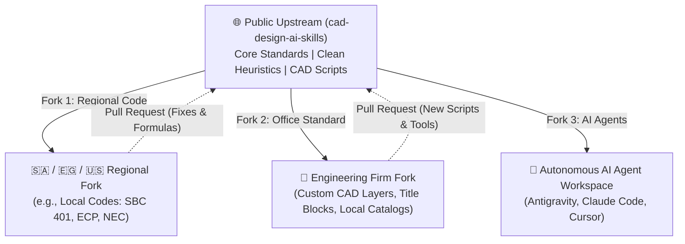

# CAD Design AI Skills 🚀

[](https://opensource.org/licenses/MIT)
[](CONTRIBUTING.md)
[](#standards)
[](#ai-agents)

> **The Open-Source Engineering Knowledge Base, Design Heuristics, and Automation Tools for MEP Design, CAD Scripting, and AI Agents.**

---

## 🌟 Vision & Purpose

Modern engineering design is moving from manual drafting to **Agentic pair-programming and generative CAD automation**. However, AI models (LLMs) frequently hallucinate without strict, real-world engineering constraints:
* They miss vertical pipe risers and wall drops in 2D architectural drawings.
* They place bedside switches on the hinge side of the door or behind closets.
* They run random spiderweb wiring across architectural slabs without orthogonal discipline.
* They size cables purely on current without verifying voltage drop across long runs.

**`cad-design-ai-skills`** bridges this gap. It provides a battle-tested, modular engineering brain containing:
1. **Curated Domain Heuristics**: Deterministic rules of thumb, spacing constraints, and installation formulas.
2. **AI Agent Skills**: Standardized markdown skills designed for instant injection into AI coding assistants (**Antigravity, Claude Code, Cursor, Copilot, Cline**).
3. **Headless CAD Automation**: Python and DXF tools for silent CAD analysis, batch processing, and drafting.
4. **Standard MEP Templates**: 5-Tab dynamic Excel BOQ spreadsheets and AIA layer guidelines.

---

## 🏗️ Repository Architecture

```
cad-design-ai-skills/
├── 📄 README.md                    # Main documentation & quickstart
├── 📄 FORK_GUIDE.md                # How to Fork & customize for your firm or regional code
├── 📄 CONTRIBUTING.md              # Community guidelines for adding rules & scripts
├── 📄 LICENSE                      # MIT Open Source License
│
├── 📂 skills/                      # AI-Ready Engineering Skills (Markdown Specs)
│   ├── ⚡ electrical/             # Lighting grids, power outlets, panel balancing, cable sizing
│   ├── 💧 plumbing/               # Water supply, drainage, 3D risers, booster pump stations
│   ├── ❄️ hvac/                   # Heat load estimation, duct sizing, smoke extraction
│   ├── 🔥 firefighting/           # Sprinkler density, NFPA 13 spacing, fire pumps
│   ├── 📊 quantity_takeoff/       # Senior BOQ rules, derived fittings, rate analysis
│   └── 📐 cross_cutting/          # CAD layer fidelity, circuit numbering, homerun arrows
│
├── 📂 heuristics/                  # Machine-Readable AI Knowledge Graphs (JSON)
│   ├── 🧠 mep_design_heuristics.json  # Sanitized engineering rules & constants
│   └── 💻 cad_scripting_tricks.json   # Headless CAD, ezdxf, and COM automation tricks
│
├── 📂 cad_automation/              # Standalone Open-Source Tools & CLI Calculators
│   ├── 🛠️ cable_sizer.py          # IEC 60364 / SBC 401 cable & voltage drop calculator
│   ├── 🛠️ lumen_calculator.py     # Room lumen method & orthogonal grid distributor
│   ├── 🛠️ panel_balancer.py       # 3-Phase panel schedule load balancing algorithm
│   └── 🛠️ dwg_headless_batch.py   # Silent headless CAD batch inspection script
│
├── 📂 templates/                   # Production-Ready BOQ & CAD Standards
│   └── 📊 mep_standard_boq_template.xlsx  # 5-Tab dynamic formula BOQ spreadsheet
│
└── 📂 .agent/                      # Drop-in Agent Skills (Antigravity / Claude / Cursor)
```

---

## 🍴 The "Fork & Extend" Philosophy

This repository is built around the **Upstream / Downstream** model:



* **Step 1: Fork this repo** to establish your firm's or region's private engineering knowledge base.
* **Step 2: Add firm-specific palettes**, local equipment schedules, or proprietary CAD layer mappings.
* **Step 3: Contribute upstream!** When you fix a formula, optimize a CAD script, or document a new international code heuristic, submit a Pull Request back to this repository so engineers globally benefit.

👉 Read the full **[Fork & Customization Guide](FORK_GUIDE.md)** for detailed instructions.

---

## 🤖 Using with AI Agents

### 1. Antigravity / Claude Code / Cursor
Copy or symlink the `skills/` folder into your agent's knowledge workspace:
```bash
# Clone the repository
git clone https://github.com/wabdelgilil/cad-design-ai-skills.git

# Point your AI Agent to the skills folder
export AGENT_SKILLS_PATH="./cad-design-ai-skills/skills"
```

### 2. Loading Heuristics in Python Agents
```python
import json

with open("heuristics/mep_design_heuristics.json", "r", encoding="utf-8") as f:
    knowledge_base = json.load(f)

# Access lighting rules
lighting_rules = knowledge_base["lighting"]
print("Living room target lux:", lighting_rules["space_lux_targets"]["living_room"])
```

---

## 🛠️ CLI Quickstart

The repository includes standalone, zero-dependency Python engineering tools:

### Cable Sizing & Voltage Drop:
```bash
python cad_automation/cable_sizer.py --load 18.5 --voltage 400 --pf 0.85 --length 65 --system 3ph
```

### Room Lighting Grid:
```bash
python cad_automation/lumen_calculator.py --length 6.0 --width 4.5 --target-lux 300 --lumens 1200
```

### Three-Phase Panel Balancer:
```bash
python cad_automation/panel_balancer.py
```

---

## 📜 Contributing & Governance

Contributions from MEP design engineers, CAD managers, and AI researchers are welcome!
Please review our **[Contributing Guidelines](CONTRIBUTING.md)** before submitting Pull Requests.

---

## 📄 License

This project is licensed under the **MIT License** - see the [LICENSE](LICENSE) file for details.
