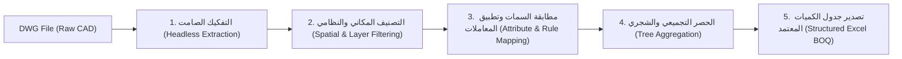

# مهارة الأتمتة الهندسية 03: خط أنابيب الحصر الآلي السريع (Batch QTO Pipeline)

> **الهدف:** توثيق خطوات خط الأنابيب المؤتمت بالكامل (End-to-End Headless QTO Pipeline) لتحويل ملفات الـ DWG الهندسية الضخمة مباشرة إلى جداول كميات مسعرة (Priced BOQs) بدقة واحترافية وبدون أي تدخل يدوي.

---

## 1. مراحل خط أنابيب الحصر المؤتمت (Pipeline Stages)

---

## 2. تفاصيل الخطوات البرمجية

### الخطوة 1: التفكيك الصامت والمسح الشامل (Headless Extraction)
- تشغيل `accoreconsole` أو قارئ الـ DWG في وضع القراءة فقط (`/readonly`).
- استخراج بيانات الكتل (`INSERT`)، السمات (`ATTRIB`)، الأبعاد، وأطوال الخطوط ومسارات البولي لاين (`LWPOLYLINE`).
- توليد ملف كشفي وسيط بصيغة JSON مهيكلة تحتوي على:
  - اسم الكتلة / الكيان.
  - إحداثيات النقطة المركزية `(X, Y, Z)`.
  - اسم الطبقة `Layer`.
  - مقبض الكيان `Handle`.
  - معلمات الدوران والمقياس `Rotation & Scale`.

### الخطوة 2: التصنيف المكاني والنظامي (Spatial & System Categorization)
- تقسيم المخطط إلى مربعات جغرافية (Floors / Spatial Zones) اعتماداً على مصفوفة المخطط (`Plan Locations Grid`).
- فرز الكيانات تلقائياً حسب الدور:
  - أرضي (Ground Floor)
  - أول (First Floor)
  - متكرر / ملحق (Typical / Roof)
- عزل كل نظام بناءً على كود الطبقة القياسي (Layer Standard):
  - `E-LGT-*` ⬅️ الإنارة والمفاتيح
  - `E-PWR-*` ⬅️ القوى والبرايز
  - `E-AC-*` أو `M-ELEC-*` ⬅️ التكييف والمحركات
  - `E-PANEL-*` ⬅️ اللوحات والكابلات
  - `E-LC-*` ⬅️ التيار الخفيف والشبكات والصواعق

### الخطوة 3: مطابقة السمات وتطبيق معاملات الحصر الحرفية (Rules Mapping)
- تطبيق القواعد الهندسية المسجلة في `core/skills/electrical_takeoff/`:
  - **الإسقاط الرأسي (Vertical Drops):** إضافة +1.8م للمفاتيح، +0.6م للبرايز، +2.3م للأسرة.
  - **معاملات الهالك واللفات (Slack & Scrap):** إضافة 10% للأطوال و 3م عند نهايات اللوحات (Panel Termination Slack).
  - **تطابق الوحدات:** فحص مقياس رسم البلوك (Block Scale) للتأكد من عدم وجود بلوكات مشوهة أو مسجلة بوحدات غير قياسية.

### الخطوة 4: التجميع الشجري للمشروع (Hierarchical Aggregation)
- تجميع الكميات على ثلاث مستويات هرمية:
  1. مستوى الغرفة / الفراغ (Room Level).
  2. مستوى الدور / اللوحة (Floor / DB Level).
  3. مستوى المبنى الإجمالي (Project Total).

### الخطوة 5: توليد مخرجات جدول الكميات (Excel BOQ Generation)
- توليد مصنف إكسيل تفاعلي يحتوي على الصيغ الحسابية (`SUM`, `PRODUCT`) وفق تبويبات الكود السعودي (SBC 401):
  - تبويب الإنارة والتحكم (Lighting & Control).
  - تبويب القوى والتغذية والمحركات (Power, HVAC & Isolators).
  - تبويب اللوحات والكابلات ومساراتها (Panels, Cables & Containment).
  - تبويب التيار الخفيف ونظام الصواعق (Low Current & LPS).
  - التبويب الإجمالي والملخص العام (Grand Summary & Pricing).
