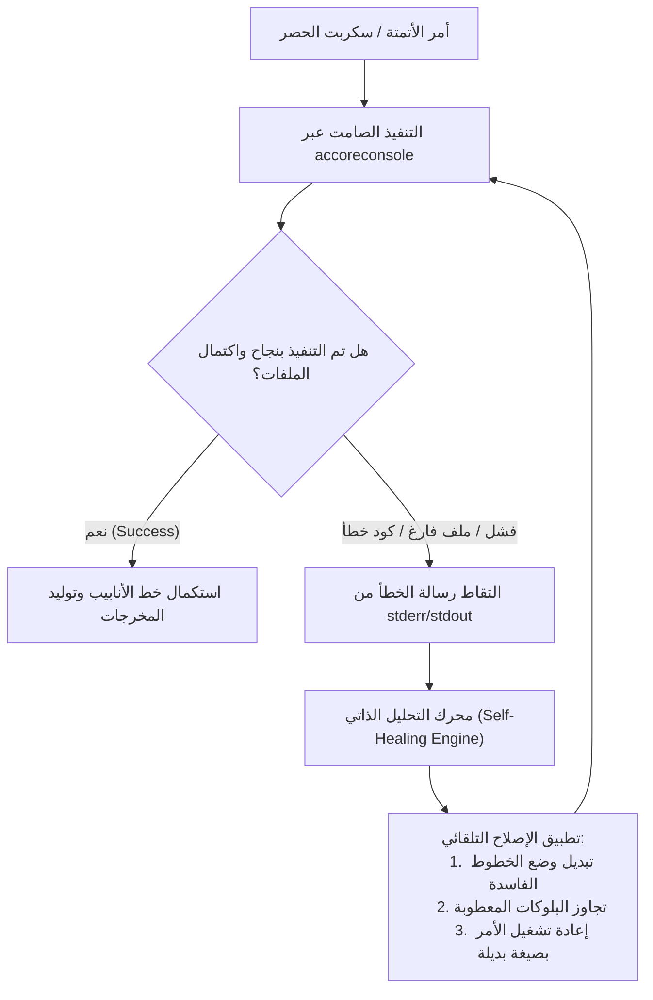

# مهارة الأتمتة الهندسية 04: ذكاء معالجة البلوكات الديناميكية والتصحيح الذاتي (Block Intelligence & Self-Healing Automation)

> **الهدف:** معالجة المشكلات الأكثر تعقيداً في مخططات الكاد الحقيقية: استخراج الأسماء الحقيقية للبلوكات الديناميكية المجهولة (`*U Anonymous Blocks`)، وتطبيق حلقة تصحيح ذاتي فورية (Self-Healing Feedback Loop) عند فشل تنفيذ أوامر الأتمتة الصامتة.

---

## 1. مشكلة البلوكات الديناميكية المجهولة (The Anonymous `*U` Block Problem)

في أوتوكاد، عندما يقوم المهندس بتعديل بارامترات بلوك ديناميكي (مثل زاوية الإضاءة، فتحة المخرج، أو نوع المفتاح)، ينشئ أوتوكاد نسخة جديدة مجهولة الاسم تبدأ بالرمز `*U` (مثل `*U38` أو `*U81`).

### العواقب في الحصر الساذج:
- قراءة اسم البلوك مباشرة عبر `(cdr (assoc 2 entget))` يعيد الاسمين المشوهين `*U38` و `*U81`.
- يؤدي ذلك إلى ضياع توصيف العنصر أو تصنيفه كبلوك غريب غير معروف، مما يُسقط وحدات الإنارة أو الأفياش من جدول الكميات.

### الحل الهندسي الذكي: كشف الاسم الفعلي (`EffectiveName` Resolution)
- **في بيئة أوتوكاد العادية ذات الواجهة الرسومية:**
  يمكن استخدام `ActiveX`: `(vla-get-effectivename (vlax-ename->vla-object ent))`.
- **في بيئة الأتمتة الصامتة (`accoreconsole`):**
  تفشل دوال COM/ActiveX بخطأ `bad argument type: VLA-OBJECT nil` لعدم تهيئة سيرفر OLE.
  **الحل المعماري الحصري (Pure DXF Resolution):**
  الوصول مباشرة إلى جدول الكتل الأصلي عبر بيانات XDATA لتطبيق `AcDbBlockRepBTag`:
  ```lisp
  (defun get-effective-name (ent / blk-name blk-rec ed-br xdata app-data parent-h parent-ent true-name)
    (setq blk-name (cdr (assoc 2 (entget ent))))
    (if (and blk-name (wcmatch blk-name "`*U*"))
      (progn
        (setq blk-rec (tblobjname "BLOCK" blk-name))
        (if blk-rec
          (progn
            (setq ed-br (entget (cdr (assoc 330 (entget blk-rec))) '("AcDbBlockRepBTag")))
            (setq xdata (assoc -3 ed-br))
            (if xdata
              (progn
                (setq app-data (cdr (assoc "AcDbBlockRepBTag" (cdr xdata))))
                (setq parent-h (cdr (assoc 1005 app-data)))
                (if parent-h
                  (progn
                    (setq parent-ent (handent parent-h))
                    (if parent-ent (setq true-name (cdr (assoc 2 (entget parent-ent)))))))))))
        (if true-name true-name blk-name))
      blk-name))
  ```
- هذا الإجراء يُعيد فورياً وبدقة 100% الاسم الحقيقي الأصلي (مثل `Switch 1 Gang` أو `SMDB WITH INCOMING MCCB DN` أو `TRAY 600`) في أجزاء من الملي ثانية وبدون أي أخطاء COM!

---

## 2. معمارية حلقة التصحيح الذاتي (Self-Healing Execution Loop)

مستوحاة من أحدث أنظمة تكامل الذكاء الاصطناعي مع الكاد (مثل `Scripture` و `Roslyn Self-Repair`):



### قواعد التصحيح الذاتي في بيئة Headless:
1. **التقاط التحذيرات الحابسة (Catching Blocking Prompts):**
   - فحص وجود كلمات مفتاحية مثل `Invalid file`, `Substitute font`, `Audit needed`.
   - إصلاحها تلقائياً ببدء الجلسة بأمر `_RECOVER` أو تحويل المتغيرات `FONTALT` إلى خط افتراضي.
2. **عزل الكيانات التالفة (Fault-Tolerant Parsing):**
   - في حال واجه المحرك كياناً يحتوي على إحداثيات فاسدة (`NaN` أو `Inf`)، يتم تجاوزه فوراً وتوثيقه في ملف سجل التدقيق (`audit_log.json`) دون إيقاف حصر باقي آلاف العناصر.

---

## 3. التدقيق المتقاطع بالرؤية الحاسوبية (Vision-Assisted Cross-Check)

- مستوحى من تقنيات اكتشاف الرموز المفتوحة (`MEPdetect`):
- يتم تصدير لقطات صور عالية الدقة للفراغات الحساسة وتراكب الرموز المحصورة فوقها بصرياً.
- إذا وجد الذكاء الاصطناعي عبر نموذج الرؤية (Vision Gate) رمزاً مرسوماً كخطوط مفككة (Exploded geometry) ولم يُسجل كبلوك، يُصدر تنبيهاً فورياً للمهندس لإضافته لحصر الكميات.
